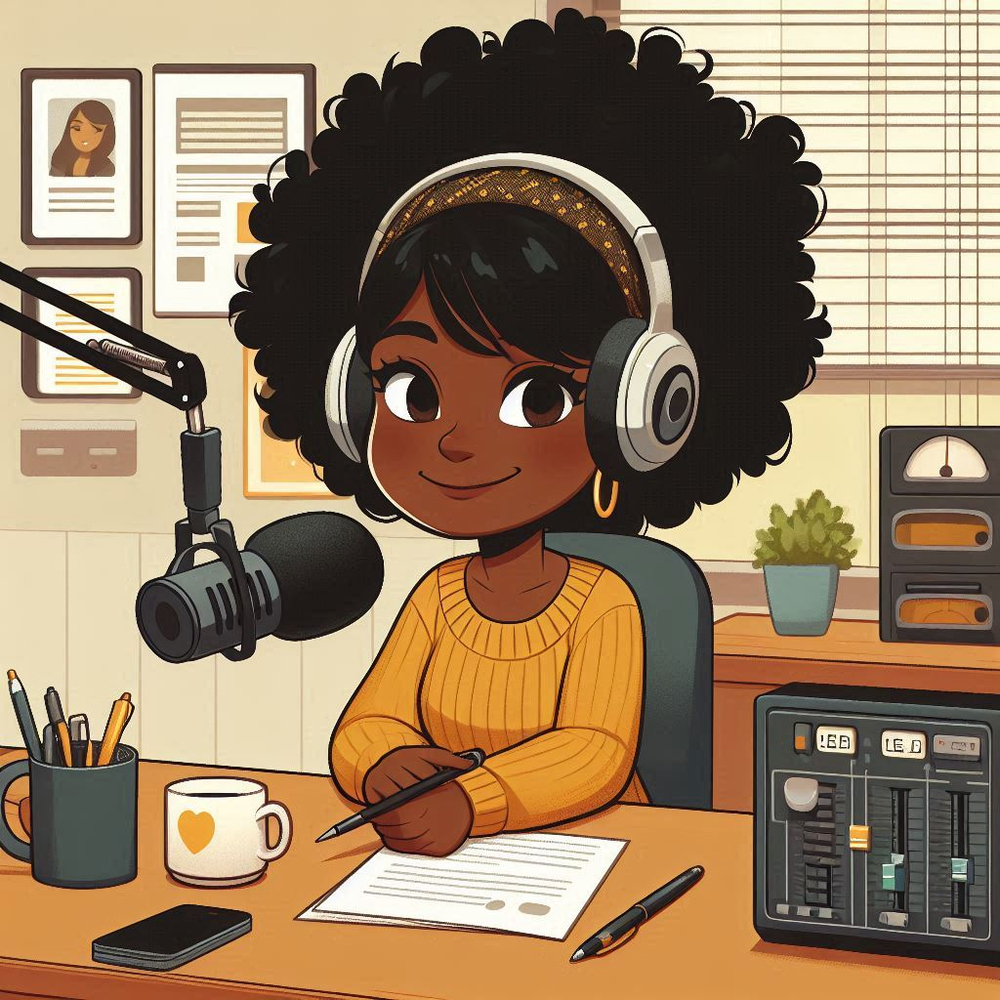

    preview do podcast

    <audio src="output/podcast.mp3" controls title="Podcast"></audio>

# Projeto Podcast Gerado por I.A.s

Projeto com o objetivo de gerar um podcast utilizando ferramentas de IA através de prompts mais trabalhado.

Utilizei uma esteira de prompts para gerar cada etapa do processo criativo.

## 💻 Tecnologias utilizadas no projeto

- [ChatGPT](https://chat.openai.com/) 
- [DALL·E 3](https://www.bing.com/images/create/?ref=hn)
- [ElevenLabs](https://beta.elevenlabs.io/)
- [Kdenlive](https://kdenlive.org/en/)
- [Free Music Archive](https://freemusicarchive.org/home)
  
## ✨ Como foi feito ?

- Roteiro gerado via chatgpt
- Audio gerado pela elevenLabs com a voz de Lilly em português
- DALL·E 3 para gerar capas
- Free Music Archive para obter sons de fundo
- Kdenlive para tratar aúdio e adicionar sons de fundo

## 📚 Materiais

- [Link da live no Youtube](https://www.youtube.com)
- [Notion Template](https://helpful-jump-17b.notion.site/PAS-Podcast-AI-Studio-210489e15d7a4a73b743bb159e45d06f?pvs=4)
- [Editor de aúdio](https://kdenlive.org/en/)

## 🛠️ Prompts utilizados no projeto

- 🤖 1. [Prompts]((src/prompts/chatgpt.md)) de roteiro no `chagpt`
- 🤖 2. [Prompts](src/prompts/roteiro-gerado-pelo-chatgpt.md) de roteiro gerados pelo chatgpt no  `ElevenLabs`
- 🤖 3. [Prompts](src/prompts/dalle.md) de artes no `DALL·E 3`

## 👨‍💻 Expert

    
    
&nbsp&nbsp&nbspAline de O. Machado 
    &nbsp&nbsp&nbsp
    <a href="https://github.com/alinemach">
    GitHub</a>&nbsp;|&nbsp;
    <a href="www.linkedin.com/in/alinemach">LinkedIn</a>
&nbsp;|&nbsp;

  

---

Feito com carinho por [Aline de O. Machado](https://github.com/alinemach)